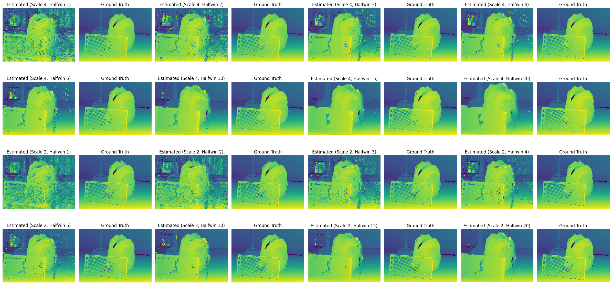
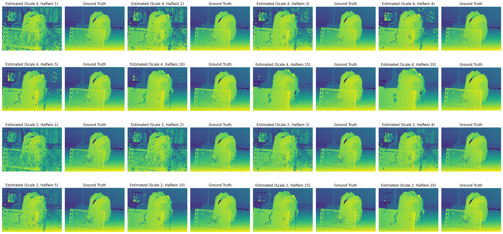
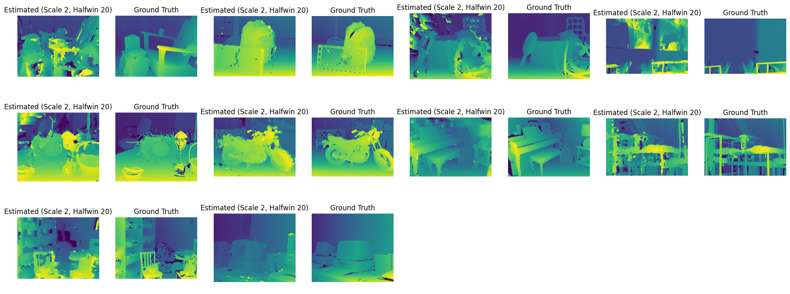

# **Report of Computing Disparity Between Stereo Images**  
**Bichuan Liu**  
**1520175**

## **1. Baseline Code**

### **1.1 How the Image Warping Code Works**  
- **First**, `disp0` saves the horizontal offset of the corresponding pixel in the left and right images. Based on these offsets, we move the pixel position of the left image pixel by pixel.  
- **Image warping** by traversing each pixel of the left image and moving those pixels horizontally to the corresponding position in the right image according to the offset calculated by the offsets.

### **1.2 Why There Are Many Black Pixels**  
- **Occlusion**: Since objects (e.g., the backpack) block the background, some pixels in the right image are not visible in the left image. The disparity map cannot match these occluded regions correctly, so they appear as black areas in the warped image.  
- **Disparity Values**: In some regions, the disparity values are very large, causing pixels to be shifted out of the image boundaries, resulting in black pixels. This typically happens near the right edges of objects.  
- **Estimation Inaccuracy**: In the background areas, the disparity estimation might be inaccurate, or the disparity values might be zero, causing these regions to fail to map correctly in the warped image.


### **1.3 How the Disparity Estimation Code Works**  
Disparity estimation calculates the pixel difference from the right image by making different offsets to the left image and selects the offset with the least error as the best disparity value for each pixel. The specific steps are as follows:  
1. **Offset scanning**: For each pixel, the code calculates the pixel difference between the left image and the right image by a different offset.  
2. **Square error calculation**: For each offset, calculate the square error of the left and right image pixels and store the results.
    ```python
    for offset in range(maxoffset):
        diff = im1[0, :, 0:cols-maxoffset, :] - im0[0, :, offset:cols-maxoffset+offset, :]
        diffsq = diff * diff
        diffsumsq.append(tf.math.reduce_sum(diffsq, axis=-1, keepdims=True))
    ```
3. **Convolutional window smoothing**: The convolutional window is used for weighted summation of errors to consider the influence of neighboring pixels and reduce noise.  
4. **Best disparity selection**: Find the offset with the smallest error through the `argmin()` function as the best disparity value.  
5. **Accuracy calculation**: The process effectively smooths out the disparity estimation and ultimately finds the best disparity for each pixel.


### **1.4 Description of the Errors**  
- **Error term in Disparity Code**: The **error** calculated is the square of the difference between the pixels in the left and right images, describing how well each pixel matches in the two images. The **greater the error**, the higher the **inaccuracy** in parallax matching.  
- **Quantitative Analysis**: Using an error threshold of **2.5 pixels**, the accuracy rate is **56.41%**, indicating that about 56.41% of the pixel errors are less than 2.5 pixels.
    ```
    189005  out of  335053  pixels =  56.41047834223242 %
    ```  
- **Source of Error**:  
  - **Occlusion**: Disparity estimation makes it difficult to deal with occluded areas.  
  - **Low Texture Areas**: In regions without significant features (walls, floors), disparity estimation is not accurate.  
  - **Object Boundaries**: Large depth variations at object boundaries often lead to inaccurate disparity estimation.

---

## **2. Effect of Window Size**

### **2.1 Results**  
| **Halfwin Size** | **Scale 4 Accuracy (%)** | **Scale 2 Accuracy (%)** |  
|-----------------|-------------------------|-------------------------|  
| 1               | 41.48%                  | 24.30%                  |  
| 2               | 56.41%                  | 36.85%                  |  
| 3               | 64.17%                  | 47.24%                  |  
| 4               | 67.92%                  | 54.15%                  |  
| 5               | 69.76%                  | 58.23%                  |  
| 10              | 71.99%                  | 63.01%                  |  
| 15              | 71.50%                  | 63.36%                  |  
| 20              | 69.79%                  | 62.93%                  |  
| 25              | 66.86%                  | 61.50%                  |  



### **2.2 Analysis**

#### **2.2.1 Quantitative Analysis**  
- **Impact of Window Size**:  
  - **Scale = 4**: As window size increases from **1 to 10**, accuracy improves from **41.48% to 71.99%**. However, accuracy declines slightly to **69.79%** when window size increases beyond **halfwin = 10**.  
  - **Scale = 2**: Accuracy improves steadily from **24.30% to 63.36%** as the window size increases, but beyond **halfwin = 15**, accuracy decreases slightly.

- **Effect of Scale**:  
  - Overall, **scale = 4** performs better than **scale = 2**. Downsampling at a higher scale reduces detail but simplifies pixel matching, leading to more accurate disparity estimation.

#### **2.2.2 Qualitative Analysis**  
- **Small Window (halfwin = 1-2)**:  
  Disparity maps are full of **noise**, especially in object edge and background regions. The window is too small to capture enough context information, resulting in **inaccurate pixel matching**. This effect is more pronounced at **scale = 2**, where **object contours appear blurry**, and the background has **many mismatches**.

- **Medium Window (halfwin = 4-5)**:  
  As the window size increases, **noise is significantly reduced**, and **object boundaries become clearer**. At **scale = 4**, disparity maps are **much more accurate** at **halfwin = 5**, with **sharper object contours** and **improved depth estimation**. The background also shows **fewer erroneous regions**.

- **Large Window (halfwin = 10-25)**:  
  As the window increases to **halfwin = 10-15**, disparity maps become **smoother**, and the **noise almost disappears**. However, at **very large window sizes**, disparity maps **lose detail**, particularly around **object edges** and in regions with **sharp depth changes**. Excessive smoothing results in a **loss of object detail**.

---

## **3. Centre Weighted Window**

### **3.1 Results**  
| **Halfwin Size** | **Scale 4 Accuracy (%)** | **Scale 2 Accuracy (%)** |  
|-----------------|--------------------------|--------------------------|  
| 1               | 34.75%                   | 20.41%                   |  
| 2               | 48.82%                   | 29.86%                   |  
| 4               | 64.34%                   | 47.50%                   |  
| 5               | 67.43%                   | 53.18%                   |  
| 10              | 71.76%                   | 62.39%                   |  
| 15              | 71.65%                   | 63.34%                   |  
| 20              | 70.53%                   | 63.46%                   |  
| 25              | 68.85%                   | 63.12%                   |  



### **3.2 Analysis**  
- **Optimal Window Size**:  
  - At **scale = 4**, the highest accuracy is **71.76%** at **halfwin = 10**.  
  - At **scale = 2**, accuracy improves with increasing window size, peaking at **halfwin = 20 (63.46%)**.

- **Comparison with Uniform Windows**:  
  - For **small windows (halfwin = 1-2)**, center-weighted windows perform worse than uniform windows because Gaussian weighting reduces the importance of edge pixels, making small windows unable to capture global image features effectively.  
  - For **larger windows (halfwin ≥ 10)**, center-weighted windows perform similarly to uniform windows, as Gaussian weighting reduces errors in edge matching and retains key information at the center, improving overall accuracy.

---

## **4. Obtain Performance Across the Whole Dataset**

### **4.1 Results**  
| **Image Folder**      | **Gaussian halfwin = 20** | **Uniform halfwin = 20** |  
|-----------------------|---------------------------|--------------------------|  
| Adirondack-perfect     | 33.68%                    | 31.59%                   |  
| Backpack-perfect       | 63.46%                    | 63.34%                   |  
| Cable-perfect          | 29.63%                    | 29.96%                   |  
| Classroom1-perfect     | 44.70%                    | 42.73%                   |  
| Mask-perfect           | 25.54%                    | 26.82%                   |  
| Motorcycle-perfect     | 54.26%                    | 53.67%                   |  
| Piano-perfect          | 33.44%                    | 32.99%                   |  
| Pipes-perfect          | 30.49%                    | 31.25%                   |  
| Playroom-perfect       | 25.35%                    | 24.29%                   |  
| Vintage-perfect        | 14.68%                    | 14.96%                   |  

1. **Gaussian Window Results**  
  

2. **Uniform Window Results**  
  

### **4.2 Analysis**

1. **Performance**:  
   - **Best performance** is observed in **Backpack-perfect** and **Motorcycle-perfect**, with accuracies of **63.46%** and **54.26%**, respectively. These scenes have **clear object boundaries** and **distinct depth variations**, leading to **better disparity estimation**.  
   - In **Vintage-perfect** and **Playroom-perfect**, performance is poor, with accuracies below **25%**, due to **background complexity** and **small objects**, which make depth estimation more challenging.

2. **Error Analysis**:  
   - **Loss of Detail**: In complex scenes, depth estimation accuracy is lower because these scenes contain **complex background details** and **lack significant depth changes** on object surfaces. This results in **poor differentiation** between object and background, causing large disparity estimation errors.  
   - **Noise Influence**: In scenes like *Adirondack-perfect* and *Mask-perfect*, **similar textures** between foreground and background cause **noise**, which **interferes with depth estimation**.  
   - **Edge Blur**: Disparity estimation is less accurate at **object boundaries**, especially in scenes with **sharp depth variations**, such as *Classroom1-perfect* and *Pipes-perfect*, where object edges tend to **blur**.

3. **Suggestions**:  
   - **Adaptive Window Strategy**: Implementing an **adaptive window** that adjusts size and weight distribution based on **local scene features** can better balance **noise reduction** and **detail retention**, especially in complex scenes like *Playroom-perfect* and *Vintage-perfect*.  
   - **Multi-Scale Feature Extraction**: Analyzing scenes at **multiple scales** would improve **depth accuracy**, particularly in **Pipes-perfect** and **Classroom1-perfect**, by capturing **finer depth variations** and reducing **edge blurring**.  
   - **Edge Enhancement**: **Edge detection** techniques can improve **depth accuracy** along **sharp boundaries**, particularly in scenes like *Motorcycle-perfect* and *Backpack-perfect*, where precise **edge definition** is crucial.