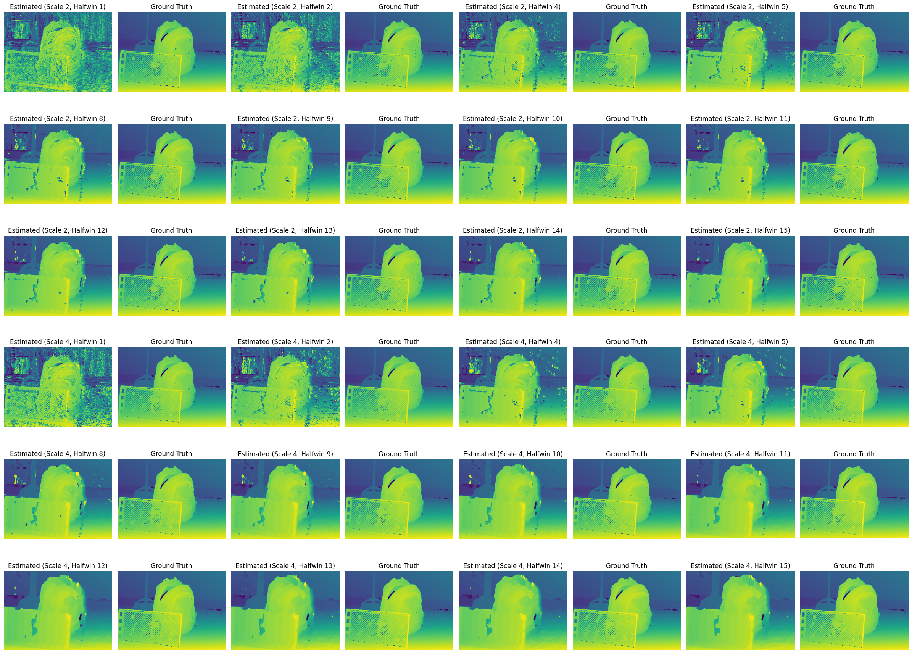
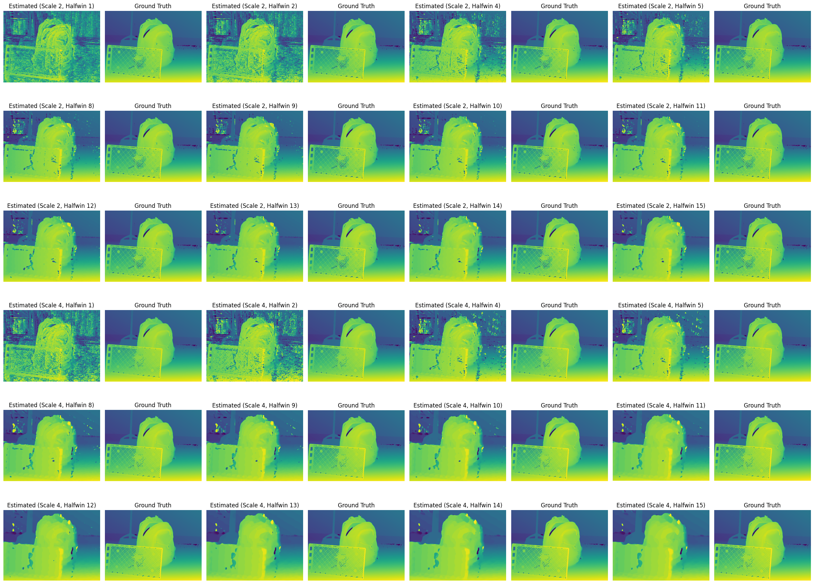
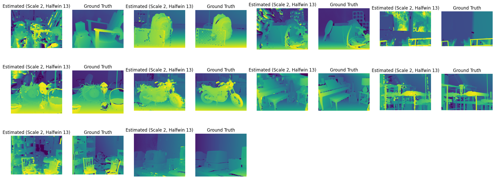
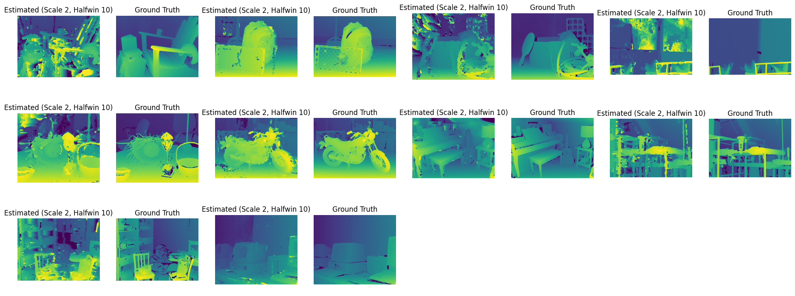

# **Report of Computing Disparity Between Stereo Images**  
**Bichuan Liu**  
**1520175**

## **1. Baseline Code**

### **1.1 How the Image Warping Code Works**  
- **First**, `disp0` saves the horizontal offset of the corresponding pixel in the left and right images. Based on these offsets, we move the pixel position of the left image pixel by pixel.  
- **Image warping** by traversing each pixel of the left image and moving those pixels horizontally to the corresponding position in the right image according to the offset calculated by the offsets.

### **1.2 Why There Are Many Black Pixels**  
- **Occlusion**: Since objects (e.g., the backpack) block the background, some pixels in the right image are not visible in the left image. The disparity map cannot match these occluded regions correctly, so they appear as black areas in the warped image.  
- **Disparity Values**: In some regions, the disparity values are very large, causing pixels to be shifted out of the image boundaries, resulting in black pixels. This typically happens near the right edges of objects.  
- **Estimation Inaccuracy**: In the background areas, the disparity estimation might be inaccurate, or the disparity values might be zero, causing these regions to fail to map correctly in the warped image.


### **1.3 How the Disparity Estimation Code Works**  
Disparity estimation calculates the pixel difference from the right image by making different offsets to the left image and selects the offset with the least error as the best disparity value for each pixel. The specific steps are as follows:  
1. **Offset scanning**: For each pixel, the code calculates the pixel difference between the left image and the right image by a different offset.  
2. **Square error calculation**: For each offset, calculate the square error of the left and right image pixels and store the results.
    ```python
    for offset in range(maxoffset):
        diff = im1[0, :, 0:cols-maxoffset, :] - im0[0, :, offset:cols-maxoffset+offset, :]
        diffsq = diff * diff
        diffsumsq.append(tf.math.reduce_sum(diffsq, axis=-1, keepdims=True))
    ```
3. **Convolutional window smoothing**: The convolutional window is used for weighted summation of errors to consider the influence of neighboring pixels and reduce noise.  
4. **Best disparity selection**: Find the offset with the smallest error through the `argmin()` function as the best disparity value.  
5. **Accuracy calculation**: The process effectively smooths out the disparity estimation and ultimately finds the best disparity for each pixel.


### **1.4 Description of the Errors**  
- **Error term in Disparity Code**: The **error** calculated is the square of the difference between the pixels in the left and right images, describing how well each pixel matches in the two images. The **greater the error**, the higher the **inaccuracy** in parallax matching.  
- **Quantitative Analysis**: Using an error threshold of 2.5 pixels, the accuracy rate is **77.36%**, indicating that about 77.36% of the pixel errors are **less than 2.5 pixels**.
    ```
    64127  out of  82892  pixels =  77.36210973314674 %
    ```  
- **Source of Error**:  
  - **Occlusion**: Disparity estimation makes it difficult to deal with occluded areas.  
  - **Low Texture Areas**: In regions without significant features (walls, floors), disparity estimation is not accurate.  
  - **Object Boundaries**: Large depth variations at object boundaries often lead to inaccurate disparity estimation.

---

## **2. Effect of Window Size**

### **2.1 Results**  
| **Halfwin Size** | **Scale 4 Accuracy (%)** | **Scale 2 Accuracy (%)** |  
|-----------------|-------------------------|-------------------------|  
| 1               | 52.36%                  |  36.83%                 |  
| 2               | 67.93%                  |  51.31%                 |  
| 4               | 79.69%                  |  69.13%                 |  
| 5               | 81.21%                  |  73.33%                 |  
| 8               | 82.28%                  |  77.60%                 |  
| 9               | 82.15%                  |  77.87%                 |  
| 10              | 81.90%                  |  77.99%                 |  
| 11              | 81.55%                  |  77.97%                 |  
| 12              | 81.16%                  |  77.86%                 |  
| 13              | 80.72%                  |  77.70%                 |  
| 14              | 80.23%                  |  77.52%                 |  
| 15              | 79.69%                  |  77.31%                 | 



### **2.2 Analysis**

#### **2.2.1 Quantitative Analysis**

- **Impact of Window Size**:  
  - **Scale = 4**: As the window size increases from **1 to 8**, accuracy improves from **52.36% to 82.28%**. Beyond **halfwin = 9**, accuracy stabilizes around **81-82%**, indicating that further increases in window size do not significantly improve accuracy.  
  - **Scale = 2**: The accuracy increases steadily from **36.83% to 77.99%** as the window size increases, with **halfwin = 10** yielding the highest accuracy at **77.99%**. After this point, the accuracy remains relatively stable around **77%**.

- **Effect of Scale**:  
  - Overall, **scale = 4** performs better than **scale = 2** across all window sizes. Downsampling at a higher scale simplifies pixel matching, resulting in more accurate disparity estimation, especially when larger windows are used.  
  - The **accuracy improvements** are more **pronounced** at smaller window sizes, especially when the window size increases from **1 to 5**. At larger window sizes, the difference in performance between scales becomes less significant.

#### **2.2.2 Qualitative Analysis**

- **Small Window (halfwin = 1-2)**:  
  Disparity maps show significant **noise**, particularly around **object edges** and in **background regions**. The small window size fails to capture sufficient contextual information, leading to **inaccurate pixel matching**. This effect is more severe at **scale = 2**, where object contours appear more **blurred**, and the background contains **many mismatches**.  

- **Medium Window (halfwin = 4-5)**:  
  As the window size increases, **noise is greatly reduced**, and **object boundaries become sharper**. At **scale = 4**, disparity maps at **halfwin = 5** are significantly more **accurate**, with **clearer object contours** and **improved depth estimation**. The background contains fewer erroneous regions, making the maps much cleaner.  

- **Large Window (halfwin = 8-15)**:  
  With larger windows, disparity maps become **smoother** and **noise is nearly eliminated**. Larger windows capture more context, reducing mismatches in disparity estimation. In the range of **halfwin = 10-15**, the results show **higher accuracy**, particularly around **object edges** and **regions with sharp depth changes**. The larger window effectively reduces noise interference and maintains high disparity estimation accuracy, even in areas with complex structures.


## **3. Centre Weighted Window**

### **3.1 Results**  

| **Halfwin Size** | **Scale 4 Accuracy (%)** | **Scale 2 Accuracy (%)** |  
|-----------------|-------------------------|-------------------------|  
| 1               | 44.65%                  |  31.34%                 |  
| 2               | 59.94%                  |  43.46%                 |  
| 4               | 76.29%                  |  62.36%                 |  
| 5               | 79.29%                  |  68.24%                 |  
| 8               | 82.07%                  |  76.22%                 |  
| 9               | 82.17%                  |  77.14%                 |  
| 10              | 82.15%                  |  77.65%                 |  
| 11              | 82.05%                  |  77.96%                 |  
| 12              | 81.80%                  |  78.13%                 |  
| 13              | 81.50%                  |  78.20%                 |  
| 14              | 81.17%                  |  78.18%                 |  
| 15              | 80.79%                  |  78.11%                 | 



### **3.2 Analysis**
#### 3.2.1 **Performance**
- **Optimal Window Size**:  
  - At **scale = 4**, the highest accuracy is **82.17%** at **halfwin = 9**. Accuracy stabilizes over **82%** for window sizes **8 to 11**, with very minor variations beyond that.
  - At **scale = 2**, accuracy peaks at **halfwin = 13**, reaching **78.20%**. Larger windows (beyond halfwin = 10) generally yield stable and high accuracy, remaining over **78%**.

- **Effect of Larger Windows**:  
  - For both **scale 4** and **scale 2**, larger windows (halfwin = 8 or greater) maintain high accuracy. The results show that larger windows help to smooth out the noise and capture more contextual information, which improves the overall disparity estimation performance.

- **Small Windows**:  
  - As seen in the results, **small windows** perform worse, with significant noise and mismatches. The low accuracy (e.g., **31.34%** for halfwin = 1) suggests that small windows fail to capture sufficient image detail for effective disparity estimation.
#### 3.2.2 **Comparsion**
Compared to the **uniform window** used in **Task 2**, the **center-weighted window** in **Task 3** shows some key differences across various window sizes:

1. **Small Window (halfwin = 1-2)**:  
   - The center-weighted window performs worse with small window sizes compared to the uniform window. For instance, with **halfwin = 1**, the accuracy for the center-weighted window is **44.65%** (scale = 4), lower than the **52.36%** for the uniform window. This is because small windows with center-weighting reduce the importance of edge pixels, leading to less effective feature capture across the image.

2. **Medium Window (halfwin = 4-5)**:  
   - For **medium-sized windows**, the performance of both window types is similar. At **halfwin = 5**, the center-weighted window achieves an accuracy of **79.29%**, close to the **81.21%** of the uniform window. The center-weighted approach effectively reduces noise while retaining key information, making its performance comparable to that of the uniform window in this range.

3. **Large Window (halfwin ≥ 8)**:  
   - For **large windows**, the center-weighted window performs similarly or slightly better than the uniform window. For example, at **halfwin = 9**, the center-weighted window achieves an accuracy of **82.17%** (scale = 4), slightly higher than the uniform window's **81.90%**. As the window size increases, center-weighting helps reduce edge matching errors while maintaining high overall accuracy.

In summary, while the center-weighted window performs slightly worse with small windows, it provides comparable or even better performance with larger windows by reducing noise and retaining essential information in the center of the window.

## **4. Obtain Performance Across the Whole Dataset**

### **4.1 Results**  
| **Image Folder**      | **Gaussian halfwin = 13** | **Uniform halfwin = 10** |  
|-----------------------|---------------------------|--------------------------|  
| Adirondack-perfect     | 53.36%                   | 51.89%                   |  
| Backpack-perfect       | 78.20%                   | 77.99%                   |  
| Cable-perfect          | 60.61%                   | 59.31%                   |  
| Classroom1-perfect     | 51.82%                   | 50.74%                   |  
| Mask-perfect           | 58.88%                   | 58.74%                   |  
| Motorcycle-perfect     | 77.22%                   | 76.48%                   |  
| Piano-perfect          | 67.74%                   | 67.20%                   |  
| Pipes-perfect          | 66.81%                   | 66.93%                   |  
| Playroom-perfect       | 51.40%                   | 49.41%                   |  
| Vintage-perfect        | 64.18%                   | 62.57%                   |  
1. **Gaussian Window Results**  


1. **Uniform Window Results**  
 

### **4.2 Analysis**

1. **Performance**:  
   - **Best results**:  
     The highest accuracy is in **Backpack-perfect** (78.20%) and **Motorcycle-perfect** (77.22%). This is because these scenes have **clear object boundaries** and **obvious depth changes**. For example, the sharp edges of the backpack and motorcycle help to match the pixels between left and right images, so it leads to fewer errors and better overall performance.

   - **Challenging scenes**:  
     On the other hand, the results in **Playroom-perfect** (51.40%) and **Mask-perfect** (58.88%) are lower. The main reason is that these scenes have **complex backgrounds** and many **small objects**. For instance, in *Playroom-perfect*, there are many toys and objects on the ground, which makes it difficult to get an accurate depth map, and this increases noise and mismatches.

2. **Error Analysis**:  
   - **Background complexity**:  
     In **Playroom-perfect** and **Vintage-perfect**, there are many objects in the background, making it hard for the system to distinguish between the foreground and background. This causes more noise in the disparity map. For example, in *Vintage-perfect*, the old computers and background mix together, making it difficult for the system to separate the objects properly.

   - **Blurry edges**:  
     In scenes like **Pipes-perfect** and **Classroom1-perfect**, the depth changes quickly, so the system struggles to maintain **sharp edges**. For instance, the pipes and furniture in these scenes have complicated shapes, which makes it hard to get clear boundaries in the depth map, leading to **blurred edges**.

   - **Low-texture areas**:  
     In **Adirondack-perfect** and **Piano-perfect**, there are some **smooth surfaces** with very few textures. This makes it difficult for the algorithm to match pixels because there are not enough **distinct features** to use for matching, which lowers the accuracy.

3. **Comparison with Uniform Window**:  
   - In most cases, **Gaussian windowing** performs better than **uniform windowing**, especially in scenes like *Backpack-perfect* and *Motorcycle-perfect*, which have **complex structures** and **clear boundaries**. The **center-weighting** of the Gaussian window helps reduce noise and improve depth accuracy at the center of the objects.  
   - However, for simpler scenes like **Pipes-perfect** and **Vintage-perfect**, the difference between **Gaussian** and **uniform windows** is not very significant. In these cases, **uniform windowing** is already good enough to achieve high accuracy.


4. **Improvement Suggestions**:  
   - **Adaptive window**: It would be better to use an **adaptive window** that can change size depending on the local scene features. This can help balance **noise reduction** and **detail preservation**, especially in more complex scenes like *Playroom-perfect* and *Vintage-perfect*.

   - **Multi-scale feature extraction**: If we apply **multi-scale feature extraction**, it can improve the accuracy in scenes like **Pipes-perfect** and **Classroom1-perfect**. This technique can help capture more **fine details** and **small depth changes**, especially around the edges.

   - **Edge enhancement**: Adding **edge detection** would help improve the accuracy in the areas with sharp edges, especially in scenes like **Motorcycle-perfect** and **Backpack-perfect**. These scenes have many clear boundaries, and improving edge detection can make the depth map more accurate.


