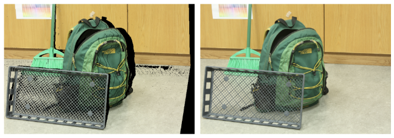
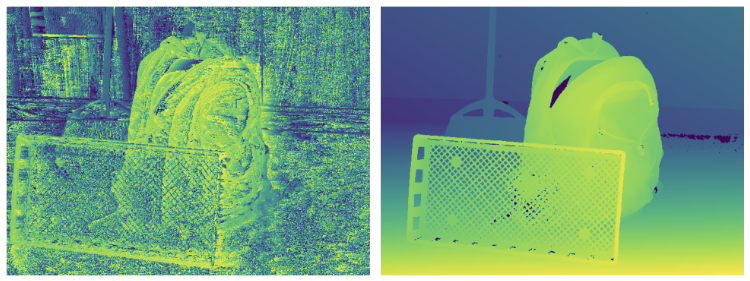

# Report of Computing disparity between stereo images
Bichuan Liu
1520175
## 1.Baseline code 
### 1.1 How the image warping code works

• First, disp0 saves the horizontal offset of the corresponding pixel in the left and right images. Based on these offsets, we move the pixel position of the left image pixel by pixel.
• Image warping by traversing each pixel of the left image and moving those pixels horizontally to the corresponding position in the right image according to the offset calculated by the offsets.
### 1.2 Why has lots of black pixels
•  **Occlusion**: Since objects (e.g., the backpack) block thebackground, some pixels in the right image are not visiblein the left image. The disparity map cannot match theseoccluded regions correctly, so they appear as black areas inthe warped image.
• **Disparity Values**: In some regions, the disparityvalues are very large, causing pixels to be shifted out ofthe image boundaries, resulting in black pixels. Thistypically happens near the right edges of objects.
• **Estimation Inaccurate:** In the background areas, the disparity estimation might be inaccurate, or the disparityvalues might be zero, causing these regions to fail to mapcorrectly in the warped image.


### 1.3 How the disparity estimation code works
Disparity estimation calculates the pixel difference from the right image by making different offsets to the left image, and selects the offset with the least error as the best disparity value for each pixel. The specific steps are as follows:

1. **Offset scanning:** For each pixel, the code calculates the pixel difference between the left image and the right image by a different offset. 
2. **Square error calculation: **For each offset, calculate the square error of the left and right image pixels, and store the results.
```python
for offset in range(maxoffset):
    diff = im1[0, :, 0:cols-maxoffset, :] - im0[0, :, offset:cols-maxoffset+offset, :]
    diffsq = diff * diff
    diffsumsq.append(tf.math.reduce_sum(diffsq, axis=-1, keepdims=True))
```  
3. **Convolutional window smoothing:** The convolutional window is used for weighted summation of errors to consider the influence of neighboring pixels and reduce noise.
4. **Best disparity selection:** Find the offset with the smallest error through the argmin() function as the best disparity value.

The process effectively smooths out the disparity estimation and ultimately finds the best disparity for each pixel.

### 1.4  Description of the errors
In the experiment, we compared the estimated disparity with the ground truth disparity, and the analysis error is as follows:
1. **Visual Differences:**
**Noise in low-texture areas**: In low-texture areas such as the ground and walls, more noise appears in the estimated disparity map.
**Object edge blur**: The estimated disparity at the edges of backpacks and other objects shows blur, indicating difficulty in estimating disparity at object boundaries.
**Occlusion area problem**: On the part of the background obscured by the backpack, the disparity estimate cannot be accurately matched, resulting in black areas.
2. **Quantitative analysis:**
The error between the estimated disparity and the ground truth is calculated using an error threshold of 2.5 pixels. The accuracy rate is 56.41%, indicating that about 56.41% of the pixel errors are less than 2.5 pixels.
```
189005  out of  335053  pixels =  56.41047834223242 %
```
3. **Source of error:**
**Occlusion**: disparity estimation makes it difficult to deal with areas where objects are obscured.
**Low texture areas:** In areas without significant features (such as walls and floors), disparity estimation is not accurate.
**Object boundaries:** Due to the large variation in depth at object boundaries, disparity estimation is often inaccurate.

